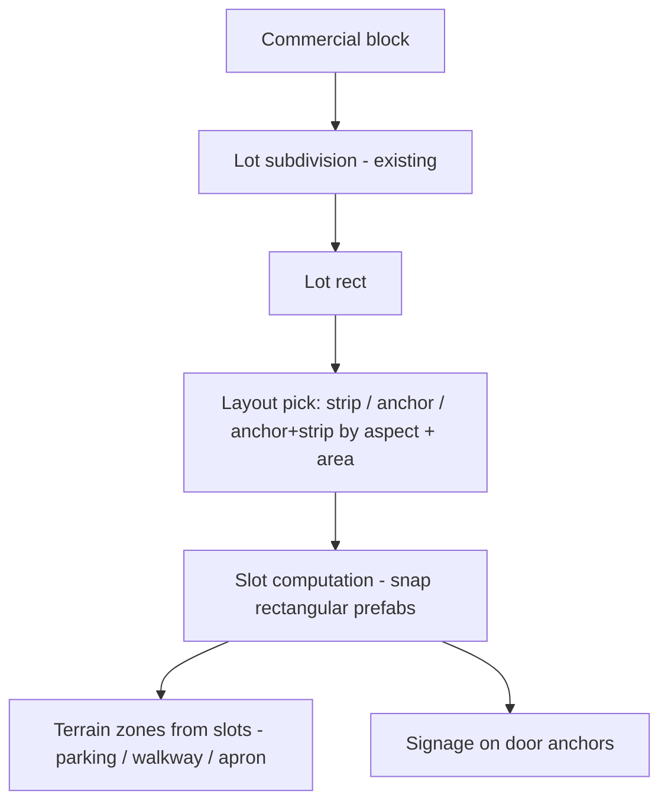

# AI Plan: Commercial District Layouts (L/U Anchors, Strips) + Signage

## 1) Goal

Make commercial districts look like real commercial strips: terrain patterns (parking,
walkways), anchor buildings (L/U-shaped supermarkets / big boxes), rows of smaller shops
stacked in a line, and business signage — while keeping **one** commercial district lot type.

## 2) Current State (verified 2026-08-24)

- `CityDistrictType.Commercial` already exists and flows through cluster planning,
  subdivision, placement, and terrain paint.
- Commercial lots: no fences, size range `CommercialLotSize` (28–56 m), whole-lot
  `RoughConcrete (14)` paint — no parking patterns (`DistrictLotTerrainLayout.commercial`).
- Building placement (`CityDistrictLotPlacement.PlaceDistrictLotBuildings`): one building
  per lot, picked from the catalog's `Commercial/` folder, biggest-footprint-first, street
  facing yaw, setback ≥ 4 m. Same code path as residential — no notion of "layouts".
- Building content comes from `ModularSingleLevelHouseGeneratorTool` (rectangular
  footprints only, W×D cells, skins + proxies). No L/U footprint support.
- Signs: only junction street-name signs (`CityStreetSignPlacer`). No commercial signage.

## 3) Core Concept — One District, Snap-Together Layouts (decided)

Keep `CityDistrictType.Commercial` unchanged. Add a **layout layer** above the existing
lot pipeline, but keep it data-light: **no layout ScriptableObject**. The lot rect
(`CityDistrictLotPlacement.ExtractLotRect`) is the only input the placer needs — it
derives the layout type from the lot's aspect/area and computes building slots by
snapping rectangular prefabs together, so buildings automatically adapt to lot width
and depth.

Rules:
- **One layout = one lot.** No cross-lot coordination, no subdivision changes in v1.
- Layout choice is pure code (constants only; promote to `CityBuildConfig` if tuning demands it).
- Everything a layout emits (slots + terrain zones) derives from the lot rect + seed.

## 4) Layout Types (inferred from lot rect)

No serialized layout definitions — the placer classifies the lot rect and computes
slots from it:

| Lot shape | Layout | Composition |
|---|---|---|
| Wide shallow (aspect ≥ ~1.6) | `Strip` | N narrow shops snapped in a line along the street frontage, parking row behind |
| Large square (area ≥ ~35² m) | `AnchorAndStrip` | 1 big box + 2–4 inline shops beside it, parking fills the rest |
| Corner lot | `CornerAnchor` | shops/anchor facing both streets |
| Small (≤ ~30 m) | `SmallShop` | 1–2 medium commercial buildings + apron |

- Shop count per frontage: `floor(frontage / shopWidthRange)` — this is the
  snap-together sizing that makes buildings follow the lot (no prefab-per-lot-size).
- Anchor size: biggest catalog entry that still fits the `lot − strip` remainder.
- Falls back to today's single-building path when nothing fits (existing failure marker).

## 5) Building Content — Snap-Together (decided: option B)

**Decision: compose from rectangles — no L/U footprint plans.** L/U shapes are produced
at placement time by snapping two rectangular generated prefabs at a corner. This avoids
the prefab explosion of pre-made L/U plans across lot sizes; sizing comes from the lot.

New generator part (content + small code):
- **Glass storefront wall** — new modular kit model, same wall dimensions as existing
  kit walls (see `modular-building-parts-components.md`). Used on street-facing facades
  of shop pieces; paired with a double-door entry variant.
- Template/wall-slot support so commercial shop templates place the glass wall on the
  street facade (side/back walls stay solid).

Shop pieces are narrow rectangular buildings from the existing generator (skins +
proxies come free). Optional polish later: a "mid-row" variant without side walls so
adjacent shops share a party wall instead of two 0.2 m end walls.

DONE (2026-08-24): four kit pieces built in Blender + imported upright (identity root
rotation, Y-up — export with `bake_space_transform`): `ShopGlass_Full`, `ShopGlass_CapLeft`,
`ShopGlass_CapRight`, `ShopGlass_CapBoth` (prefabs in `Building_Modular_Parts/`, FBX in
`Building_Modular_Parts/Meshes/`; 3 material slots: External / Internal / Glass). The
generator places them on the ground-floor door side for Commercial buildings, composed by
run length: 1-wide → CapBoth, 2-wide → CapLeft+CapRight, 3+ → CapLeft + Fulls + CapRight.
Skin tool keeps the glass slot and skins exterior/interior slots (`TryResolveShopGlassMaterials`).
Commercial roofs are flat/parapet only — picked from `RoofTypes/Flat/` (FlatRoof_Default,
FlatRoof_Overhang, FlatRoof_Parapet).

## 6) Terrain Patterns per Layout

- Layouts emit `LotSubZone` lists (reuse `LotSubZone` / `CityLotTerrainPainter`) so the
  Buildings + Lot Terrain steps stay coupled the way residential already is.
- Zones: `Parking` (clean_asphalt, new slot 16), `Walkway/Apron` (ConcreteTiles 15),
  optional `Landscaping` (grass 0/1/4 + tree scatter eligibility).
- Parking texture: `clean_asphalt_*` set already added to
  `Assets/01_Game/02_World/Terrain/Textures/` and registered as **entry 16**
  (`clean_asphalt_rough_2k`) in the `Microsplat_World` TextureArrayConfig. The texture
  is **white** — it is the PAINT colour, not the parking surface. WIRING DONE
  (2026-08-24): arrays baked (depth 17 == config count), `terrainLayer` asset created
  and assigned (`microsplat_layer_clean_asphalt_diff_2k_16.terrainlayer` — the entry
  had inherited a stale Snow_10 ref), generated shader has `_Control4` so 17 layers
  render. NOTE: "Update Splat Maps" never creates terrain layers; the paint path
  builds them in-memory via `CityLotTerrainPainter.EnsureTerrainLayers`. Current slot
  map: 12 dirt, 13 Asphalt (surface = clean_asphalt_diff_2k), 14 RoughConcrete,
  15 ConcreteTiles, 16 white paint.
- **Parking stripes are painted in the terrain step** (decided): the layout's terrain
  emission adds thin stripe zones (`LotSubZone` rects, texture 16) over the asphalt
  base (13) inside each parking area — stall lines, bay edges, and the stop line at
  the walkway. Painted in the same flush as the base so blending is deterministic.
  Two constraints to verify at implementation time:
  - Blend width: the painter's per-zone blend (0.25 m for pads) would smear thin
    stripes — add a stripe-specific blend (≤ 0.05 m) keyed on the zone name
    (`ParkingStripe`), same pattern as `PadBlendMeters`.
  - Pixel size: stripe width must stay ≥ 1 alphamap pixel at the tile's control
    resolution (~0.24 m/px at 1024 over a 250 m tile) — expect ~0.3–0.5 m painted
    stripes, which reads fine at game distance.
- Parked cars: extend `CityParkedCarPlacer` with a parking-lot mode (rows of cars in the
  parking zone, 90° to the aisle) — it already has driveway logic to mirror.

## 7) Placement Pipeline Changes

- New partial `CityCommercialLotLayoutPlanner.cs` under
  `Assets/01_Game/02_World/City/Scripts/` — DONE (2026-08-24), single file.
- Branch in `CityDistrictLotPlacement.PlaceDistrictLotBuildings`:
  `DistrictType == Commercial` → layout placer; else existing single-building path — DONE.
- Slot computation from `ExtractLotRect`: shops fill the street frontage, corner lots
  get two slots (L leg) meeting at 90°. Each slot reuses the existing fit guards
  + door anchors (`CityBuildingStreetFacingMarker`) via an override-lot-rect on
  `DistrictLotPlacementRequest` — DONE.
- Terrain: `CityPrefabRoadNetworkBuilder.Districts.cs` commercial branch paints
  `CommercialWalkway` (ConcreteTiles 15) + `CommercialParking` (Asphalt 13) zones
  from the same deterministic plan; Single lots keep the whole-lot concrete fill — DONE.
  Asset `DistrictLotTerrainLayout.asset` commercial preset updated to match.
- Catalog roles (lightweight): classify commercial catalog entries by size band first
  (footprint ≤ ~16×10 m = shop, bigger = anchor candidate). If too coarse, add a parsed
  `role` from the prefab name (`Commercial_Shop_…` / `Commercial_Anchor_…`) via
  `CityBuildingPrefabNaming`. No changes to `ResolveDistrictType` — NOT done (v1 uses
  slot-fit only, biggest-first order).
- No subdivision changes in v1 — strips live inside the existing 28–56 m lots.

## 8) Signage

- New `CityCommercialSignPlacer` (model on `CityStreetSignPlacer`): building-mounted
  signs above door anchors + optional free-standing pylon near the lot entrance.
- Content: need shop-sign prefabs (board + frame; TMP text optional — `CityNames` for
  names). Existing `SM_Street_Sign` is not usable for shopfronts.
- New pipeline step "Commercial Signs" after Buildings (grouped under Streetscape).

## 9) Decisions (agreed 2026-08-24)

1. **Snap-together (B)** — L/U anchors composed from 2 rectangular prefabs at placement
   time; shops snapped in lines. No L/U footprint plans, no per-lot-size prefab sets.
2. **No layout SO** — the district-lot subdivision already produces the lots; the layout
   placer works straight from `ExtractLotRect` for both building slots and terrain.
3. **Parking** — slot 16 (`clean_asphalt_rough_2k`) is a WHITE paint texture; stall
   lines are painted by the terrain step as thin stripe zones over asphalt (no decals).
4. **One layout = one lot.**
5. **Editor pipeline first** — runtime streamed-city parity is a follow-up.
6. Sign text (TMP names vs blank boards) — still open, decide at signage time.

## 10) Suggested Implementation Order

1. Glass storefront wall part + generator support (content + kit plumbing).
2. Generate a first batch of narrow shop pieces + a big-box set (skins + proxies via
   the existing generator flow).
3. Bake `clean_asphalt` into `Microsplat_World` as slot 16 (verify the bake recipe).
4. `CityCommercialLotLayoutPlacer` — strip layout vertical slice: shops snapped along
   the frontage, door anchors recorded.
5. Strip terrain zones (walkway + parking) via `LotSubZone` emission.
6. Anchor + AnchorAndStrip layouts (two-rectangle L/U corner snap).
7. Parked-car parking-lot mode.
8. Signage placer + prefabs + pipeline step.
9. Tuning pass; verify region mode (hub-shifted bounds rules).

## 11) Guardrails / Notes

- Files < 500 lines, methods < 15 cognitive complexity → partials.
- Region mode: always `marker.GetHubShiftedBoundsXZ()` for world-space paint/geometry.
- Proxies: L/U anchors get proxies automatically via the generator's proxy pass.
- Perf: layout placement is editor-only and per-lot; keep road-mesh collection reused
  from the existing per-pass cache (same pattern as today).

## 12) Corner Shop Buildings (added 2026-08-24)

Corner shops turn the storefront around one corner of an otherwise rectangular
footprint — the cheap stand-in for L/U corner pieces decided in §9.1.

- **No new geometry.** Reuses the existing `ShopGlass_*` pieces; the two glass runs
  meet at 90° with their cap pieces (decided: option B over a chamfered 45° corner).
- **Template flag** `ResidentialHouseTemplate.CornerStorefront` (commercial snap types
  only, `AllowSideWindows = false`).
- **Template** `Commercial_CornerShop.asset` (Templates/Commercial): SalesFloor
  required, Stockroom/CommercialKitchen optional back room, 4–6 × 4–6 cells, 1 floor,
  1 exterior door. Library auto-syncs it.
- **Door** is pinned to the corner-adjacent storefront segment (segment 0 when the
  corner side is left, `Width-1` when right) so the L-glass reads as one entrance.
- **Corner side** (left or right column) is randomized per generation.
- **Generator** (`ResolveShopGlassSegments`) composes a second glass run along the
  chosen side column; side windows are already off for snap types.
- Naming: `Commercial_Corner_Shop_<W>x<D>.prefab` via the template-name scheme.

Follow-ups (not done): door-in-glass kit parts; variant-set batch tool; signage.
