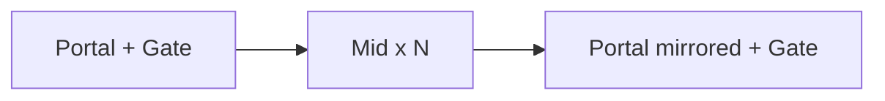

# Modular highway tunnel mesh kit (Blender MCP)

**Status: IMPLEMENTED (assets)** — FBX + Blender source + docs + editor prefab tool shipped. Run Unity menu **Tools → World → Roads → Create or Update Tunnel Kit Prefabs** after import to materialize prefabs/gate. Does **not** implement Track A mounds or Track B runtime.

**Default timing:** ship as its **own asset PR**, runnable **in parallel with Track A** and **before Track B**. Track B’s `TunnelMeshPlacer` consumes these prefabs; do not wire placer here.

Related: [mounds_and_tunnels plan](../../.cursor/plans/mounds_and_tunnels_a7d4ce23.plan.md) (Track A ship / Track B deferred).

---

## Why this comes first

Track B deferred requirements need meshes that already encode:

- **Portal daylighting collar** (visual flare that sits in the daylighting cut)
- **Tileable mid tube** along polyline stations
- **Non-enterable v1** contract via a separate gate/blocker volume (no fake NavMesh floor)

Doing geometry + export now unblocks Track B without coupling to pad grading.

---

## Fit to Track B (contract the kit must satisfy)

| Track B need | Kit answer |
|--------------|------------|
| Portal daylighting | `Tunnel_Portal` with flared mouth + short collar along +Z |
| Skip asphalt on span | **Omit floor** in v1 (walls + ceiling only); asphalt stops at portals via Track B exclusion |
| Non-enterable v1 | Separate `Tunnel_PortalGate` (invisible box collider prefab, no render mesh) |
| Highway width 12 m | Inner clear width **14 m** (12 m road + 1 m each side) |
| Place under road network root | Pivot: centerline X=0, bed Y=0, forward +Z; same LookRotation pattern as `RoadCrossingPlacer` |
| Residual/carve exclusion | Mesh does not own terrain; placer sits on portal bed Y from profile |

Do **not** ship a traversable floor collider that agents ignore under terrain-only NavMesh.

---

## Piece set (3 assets)

Paths (new):

- Meshes: `Assets/02_Shared/Meshes/Roads/Tunnel/`
- Prefabs: `Assets/02_Shared/Prefabs/Props/Road/Tunnel/`
- Docs: `docs/highway-tunnel-kit.md` (written at export time)

| Piece | File | Role |
|-------|------|------|
| Mid | `SM_Tunnel_Mid_10m.fbx` | Straight horseshoe tube, **10 m** along Z, open both ends, seamless UV phase |
| Portal | `SM_Tunnel_Portal.fbx` | One mouth: flared daylight lip + ~4 m collar; mirror via scale X = −1 for opposite portal |
| Gate | Unity-only | `Tunnel_PortalGate.prefab` — box ~14×5.5×1 m, collider only |

No bend pieces in v1 — placer rotates mid segments along highway polyline.



---

## Hard dimensions (locked)

Derived from `RoadNetworkSettings.highwayWidth` = **12**:

- Inner clear width: **14.0 m**
- Inner clear height: **5.5 m** (horseshoe crown)
- Wall/ceiling thickness: **0.6 m**
- Mid length: **10.0 m** (placer: `ceil(spanLength / 10)`)
- Portal collar length: **4.0 m** along +Z into mountain; flare ~**2 m** outward past mouth (−Z) for daylight cut blend
- Outer flare half-width at mouth: **~18 m**
- Pivot: origin at **roadbed centerline** at portal mouth / mid segment start
- Axes: Unity **Y-up**; FBX export `axis_forward='-Z'`, `axis_up='Y'`, `bake_space_transform=True` (same as shop-glass kit)

Profile: **horseshoe** (vertical walls + semicircle crown). Target ~1–2k tris per mid.

---

## Materials / UVs

- Submesh 0: exterior concrete (outer shell + portal flare)
- Submesh 1: interior concrete/dark (inner walls + ceiling)
- UV: **1 tile per metre** on large faces; mid pieces share UV phase
- No asphalt / floor submesh
- Unity: `M_Tunnel_Exterior` / `M_Tunnel_Interior` under `Assets/02_Shared/Materials/Roads/` if no suitable existing Lit materials

---

## Blender MCP workflow

**Prerequisite:** Blender MCP addon is protocol 4 vs expected 5 — run `uvx blender-mcp install-addon`, re-enable addon / restart Blender, Start MCP Server, re-check `get_addon_status`.

1. `get_scene_info` / isolate a `HighwayTunnelKit` collection.
2. `execute_blender_code` in small chunks: mid tube → portal flare → origins → UVs → materials → naming.
3. Viewport screenshot QA (mouth flare, clear width vs 12 m road).
4. Export each mesh:

```python
bpy.ops.export_scene.fbx(
    filepath=path,
    use_selection=True,
    object_types={'MESH'},
    apply_unit_scale=True,
    apply_scale_options='FBX_SCALE_ALL',
    axis_forward='-Z',
    axis_up='Y',
    bake_space_transform=True,
)
```

5. Write `docs/highway-tunnel-kit.md` (piece list, dimensions, pivot, material slots, placer notes).
6. Unity after import: visual prefabs + `Tunnel_PortalGate`; leave `RoadNetworkSettings` tunnel fields for Track B.

**Out of scope:** `MountainTunnel` artifact, scanner, carve skip, residual exclusion, fingerprint, `TunnelMeshPlacer`, NavMesh links.

---

## Acceptance

- FBX imports with identity root rotation, Y-up, pivot at bed centerline.
- Two mids abut with gap/overlap ≤ 1 cm and continuous UV phase.
- Portal mouth clear width ≥ 14 m; height ≥ 5.5 m.
- Prefabs under `Prefabs/Props/Road/Tunnel/`; docs describe Track B placement contract.
- No floor collider on visual pieces; gate prefab is collider-only.

---

## Relation to mounds / tunnels plan

- Track A (pad mounds): **unchanged** — still ship for screenshots.
- Track B “TunnelMeshPlacer”: **depends on this kit**.
- Do not revive unwired `RoadCrossingPlacer` for tunnels; Track B wires a dedicated placer into `BuildEasyRoadsMeshes`.

## Implementation order

1. Update Blender MCP addon; verify status  
2. Author mid + portal geometry  
3. Export FBX + write `docs/highway-tunnel-kit.md`  
4. Unity prefabs + portal gate  
