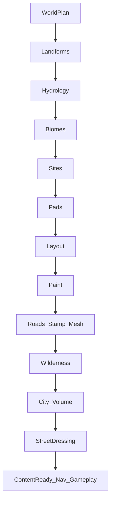

# World Builder Build Pipeline — Living Reference

You are working on Zombera’s first-party **World Builder** Build pipeline (Development Hub → Build tab).

**DAG / stage order / prereqs / outputs / Invalidates SoT:** `WorldBuildStageRegistry.BuildDefaultDescriptors` only.  
Agent routing chart (invariants / ownership / task→file): `docs/world-builder-pipeline.md`.

This document is the **living reference for**:

1. Efficiency / interaction contracts (verify against the registry)
2. Incorrect implementations found while working the pipeline (append-only log)

It is **not** the DAG source of truth, **not** a feature roadmap, and **not** a performance-optimization playbook.

| Related prompt | Owns |
|----------------|------|
| **`WorldBuildStageRegistry`** | DAG truth (order, prereqs, outputs, invalidates) |
| **`docs/world-builder-pipeline.md`** | Agent invariants / ownership / task routing |
| **This file** | Interaction contracts + incorrect-impl log (verify vs registry) |
| [`0_Stage_Issue_Index.md`](0_Stage_Issue_Index.md) + `N_*.md` | Per-stage living logs of issues / wrong paths / broken behavior |
| [`Optimise_pipeline_Prompt.md`](Optimise_pipeline_Prompt.md) | Measure and optimize performance of the existing pipeline |
| [`plan-reviewer-prompt.md`](plan-reviewer-prompt.md) | Critique a proposed change plan before coding |

**Do not invent stages.** Reconcile contradictions against:

- [`WorldBuildStageRegistry.cs`](../Assets/01_Game/02_World/CityPipeline/WorldBuilder/Core/WorldBuildStageRegistry.cs) — **registry list order is authoritative**
- [`WorldBuildPipelineRunner.cs`](../Assets/01_Game/02_World/CityPipeline/WorldBuilder/Core/WorldBuildPipelineRunner.cs)
- [`CityPipelineRunnerWindow`](../Assets/Editor/CityPipeline/CityPipelineRunnerWindow.cs) (Build tab)
- Stage implementations under `Assets/01_Game/02_World/CityPipeline/WorldBuilder/Stages/`

**Never use `WorldBuildStageId` numeric/enum order** for runs — IDs are sparse; open `WorldBuildStageId.cs` + the registry (do not copy id tables into docs).

---

# 1. Pipeline identity

| Item | Value |
|------|--------|
| Menu | `Tools → World → World Builder — Development Hub` |
| Window | `CityPipelineRunnerWindow` |
| Focus of this doc | **Build** tab only (State / Simulation / Events / Streaming / Tests are out of scope except Finalize readiness) |
| Runner | `WorldBuildPipelineRunner` |
| Facade | `WorldBuilderService` |
| Artifacts | `WorldBuildArtifacts` via `WorldBuildContext` |
| Profile | `WorldGenerationProfile` |
| City backend | `CityPrefabRoadNetworkBuilder` (many late stages wrap this) |
| Hub programmatic runner | `WorldBuilderHubPipelineRunner` |

Hub Build runs use **FullMap** scope. Runtime may use `InitialPlayArea` / bounds scopes via `WorldBuilderService` session APIs.

---

# 2. How to maintain this document

When changing the Build pipeline (or refreshing this reference):

1. Spawn **parallel subagents** (one per concern), at minimum:
   - Setup + Terrain + Planning Field + Water
   - Sites + Layout + Surfaces + Roads + Wilderness
   - Environment + City + StreetDressing + Finalize
   - Runner / artifacts / hub options / invalidation / anti-patterns
   - Optional: WorldState publish + tile readiness (`ContentReady` → `NavigationReady` → `GameplayReady`)
2. Append incorrect-impl findings to the living log; do not recreate a stage catalog here.
3. Append any new wrong approach to **Incorrect implementations** here **and** to the matching numbered stage file under [`0_Stage_Issue_Index.md`](0_Stage_Issue_Index.md) (e.g. [`1_Reset.md`](1_Reset.md)).
4. Keep registry list order as the final authority.

---

# 3. Data flow (verify vs registry)

Illustrative hub Build story only. **Re-read `BuildDefaultDescriptors` before relying on any order/edge below.** Contiguity rules for Run Section live in registry comments + `CityPipelineRunnerWindow`; do not treat this sketch as SoT.
```text
Reset / Ensure / Validate
        ↓
CreateGlobalWorldPlan → Artifacts.Plan (+ fingerprint)
        ↓
AllocateTerrainGrid → Unity Terrains + catalog
        ↓
Planning Field (contiguous):
  Landforms → Reserve pads → Erode → Hydrology → Carve (+ height bake) → Biomes
        ↓
Environment: Configure sky → Init env → Bind weather consumers
        ↓
Water: Ocean surfaces (+ re-push weather to Crest) + inland water (soft-skip if unbound)
        ↓
Sites (contiguous):
  Select sites → Plan inter-city highways → Apply city pads
  (blast radius = reverse HardPrerequisites in registry; Invalidates unused)
        ↓
Layout (contiguous): Named areas → Footpaths → District lots
        ↓
PaintNaturalSurfaces → natural alphamap only (lot stamps in City GenerateLotTerrain)
        ↓
Roads: Plan → Refine → Crossings → Tunnels → Stamp → Meshes → Infra surfaces
        ↓
Wilderness: POIs → Nature (after roads so corridors are stamped/synced)
        ↓
City (contiguous): Buildings → Lot terrain → Fences → Parks → Trees
        ↓
StreetDressing (contiguous): markings / lights / signs / lamps / power / furniture / cars
        ↓
Finalize: ContentReady → wait NavigationReady → ValidateAndPublish → GameplayReady
```



---

# 4. Efficiency contracts (how stages must interact)

## 4.1 Contiguous Run Section blocks

Do **not** insert foreign stages into these section strings. Hub **Run Section** walks unbroken `_steps` with matching `Section`. Tests enforce contiguity for several blocks.

| Section | Must stay unbroken |
|---------|-------------------|
| Planning Field | Landforms → **Reserve pads** → Erode → Hydrology → Carve → Biomes |
| Environment | Configure sky → Init env → Bind weather |
| Sites | Select → Inter-city highways → Pads |
| Layout | Named areas → Footpaths → Lots |
| City | Buildings → Lot terrain → Fences → Parks → Trees |
| StreetDressing | Markings through Parked cars |

## 4.2 Artifact reuse

| Rule | Detail |
|------|--------|
| Prefer artifacts | Downstream stages **read** `WorldBuildArtifacts`; do not rebuild upstream fields |
| Ocean mask | `CarveWaterFeatures` reuses `HydrologyPlan` ocean classification — **do not** call `BuildOceanMask` again |
| Plan fingerprint | Session seed + `profile.ComputeFingerprint()`; bump algorithm/policy versions when behavior changes |
| Same session reuse | Same seed + fingerprint → reuse artifacts/catalog; seed/profile change → clear |

## 4.3 Scoped work over full-map work

- Prefer **scoped heightmap bakes** (pad outer bounds, highway corridor rects) over full-map rebakes.
- Yield periodically on long tile loops; do not add full-scene `FindObjectsByType` on hot paths.
- Prefer NonAlloc / cached refs in stage code (see `AGENTS.md`).

## 4.4 Skip / early-out contracts

| Flag / option | Owner | Contract |
|---------------|--------|----------|
| `LotTerrainComposedDuringPaint` | Paint → Lot terrain | Legacy early-out only; Paint leaves flag **false** (natural-only). `GenerateLotTerrain` always composes on normal runs. |
| `HighwayCorridorsBakedPostRefine` | Refine / tunnel bake → road meshes | `SkipRoadTerrainHeightmapWrites` only when landforms+sites+roads **and** this flag; else fail-closed and keep writes |
| `ReuseCachedRoadsOnSameSeed` | City builder + mesh stage | Skip full city road regen when seed + meshes match; **acceptance / vertical slice forces false** |
| `SurfacePaintQuality` / hub enum | Paint | `Fast` 32×32 **block** upscale, skip soften; `Balanced` 128×128 bilinear+SoftRadius; `Quality` **256 cell paint**, SoftRadius soft **before** bilinear upscale (active-layer upscale; 1 strong coarse pass). Balanced/Quality paint tiles in **CPU batches** (`TileWorkerMode` + main-thread `SetAlphamaps`); Fast stays serial. Fast Roads does **not** force Fast paint. Acceptance / coastal verify → Quality. Fast Build iteration → Fast. |
| `FastRoads` / hub Fast Roads | Mesh stage | Sync pump (no yields); **does not** change surface paint mode |
| `FastLandforms` / `FastBiomeClassify` | Planning Field | Fewer noise octaves — iteration only; changes topology vs production |
| Soft backends | Ocean / inland water / nature / Enviro | Soft-skip with warning if unbound; do not hard-fail the run |

**Paint measure protocol:** tag `mode=` in Configure + paintTiming; Hub Medium seed ×3 Fast/Balanced/Quality; ship Balanced as Hub default only via `SurfacePaintBudgetGate` (Quality over iteration cap **and** Balanced ≤ ~0.55× Quality). Quay rock stamps after soft paint — open-beach SoftRadius crops must exclude pad seaward strips. Tile soften does not cross seams (known).

## 4.5 Partial runs

- Hub single-step: `includeMissingPrerequisites: false` — caller owns prereqs / session artifacts.
- Prefer registry-order helpers (`RunRegistryStagesFromTo`, `WorldBuildStageOrder`), **not** enum-byte `RunRange`.
- Style-match / partial starts must bootstrap (Reset / missing terrains / landforms) when artifacts are absent.

## 4.6 Invalidation

Declared `Invalidates` live in the registry (verify there). Runner `Invalidate` exists but **Assets/hub do not call it** — do not treat Invalidates as a live rebuild graph; use reverse `HardPrerequisites` closure for blast radius (see `docs/world-builder-pipeline.md`).

## 4.7 Tile readiness end-state

```text
InfrastructureReady  ← StampInfrastructureTerrain
        ↓
ContentReady         ← FinalizeTerrainTiles  (+ TileAppliedForGameplay)
        ↓
NavigationReady      ← async NavMesh → WorldBuilderService.ReportNavigationResult
        ↓                 (QueueNavMesh waits ≤120s)
GameplayReady        ← ValidateAndPublish (FullMap; validates WorldState)
```

---

# 5. Incorrect implementations (living log)

Cross-cutting / runner issues stay here. **Stage-specific** issues live in numbered files — see [`0_Stage_Issue_Index.md`](0_Stage_Issue_Index.md) (`1_Reset.md` … `46_ValidatePublish.md`). Append to the matching stage file when working that step; append here only when the problem spans multiple stages or the runner.

Append new entries when a wrong approach is found or fixed. Do **not** delete historical entries; mark `Status: fixed` instead.

### Entry template

```markdown
### YYYY-MM-DD — short title
- Symptom:
- Wrong approach:
- Why it breaks efficiency / correctness:
- Correct interaction:
- Evidence (file / stage / options / seed):
- Status: open | fixed
```

---

### 2026-09-04 — RunRange by enum byte order
- **Symptom:** “Full” or ranged runs skip Ensure stack / ocean / footpaths / inter-city highways / tunnels, or include unrelated stages.
- **Wrong approach:** `RunRange` filtered by `(byte)WorldBuildStageId` min/max.
- **Why:** Enum values are sparse and non-monotonic vs registry list order.
- **Correct interaction:** Iterate **registry list order** (`WorldBuildStageRegistry.Stages`, `WorldBuildStageOrder`, hub `RunRegistryStagesFromTo`).
- **Evidence:** `WorldBuildStageId.cs`, `WorldBuildPipelineRunner.cs`, `WorldBuilderService.RuntimeSession.cs`
- **Status:** open (hub paths prefer registry order; some `RunRange` call sites remain)

### 2026-09-04 — Invalidate cascade unused
- **Symptom:** After pads/layout/roads change, dependents may look “Done” in UI while artifacts are stale.
- **Wrong approach:** Declaring `Invalidates` on pads but never calling `WorldBuildPipelineRunner.Invalidate` from hub.
- **Why:** Stale records never mark dependents; only UI step state is tracked.
- **Correct interaction:** Until hub wires `Invalidate`, compute reverse `HardPrerequisites` closure (see `docs/world-builder-pipeline.md`) and re-run that set; do not treat declared `Invalidates` alone as complete.
- **Evidence:** `ApplyCityPads` descriptor Invalidates; no hub callers of `Invalidate`
- **Status:** open

### 2026-09-04 — SkippedCached never assigned
- **Symptom:** Cache-skip status exists in the runner but never appears in practice.
- **Wrong approach:** Relying on `SkippedCached` for artifact reuse without any stage setting it.
- **Why:** Dead path; reuse today is “already Succeeded this session” or builder-level road cache flags.
- **Correct interaction:** Either set `SkippedCached` when true artifact reuse happens, or stop treating it as a live contract.
- **Evidence:** `WorldBuildStageStatus` / runner prereq satisfaction; no assignments found
- **Status:** open

### 2026-09-04 — Inland water before crossings
- **Symptom:** Bridge/crossing cutouts missing on Crest inland water after a single Run All.
- **Wrong approach:** Assuming `BuildWaterSurfaces` sees `Artifacts.Crossings`.
- **Why:** Registry places Water before Roads; crossings are produced in `ResolveWaterCrossings`.
- **Correct interaction:** Re-run water surfaces after crossings, or move/add a post-crossing water sync stage; do not pretend crossings exist at first Water pass.
- **Evidence:** `BuildWaterSurfacesStage` reads crossings optionally; registry order Water ≪ Roads
- **Status:** open

### 2026-09-04 — Double lot-terrain / double height writes
- **Symptom:** Alphamap or heightmap work done twice; slow paints/stamps; conflicting surfaces.
- **Wrong approach:** Always running `GenerateLotTerrain` after paint compose, or skipping road height writes without `HighwayCorridorsBakedPostRefine`.
- **Why:** Breaks skip contracts; fail-closed path keeps writes on when flag missing (correct) but silent double paint is wrong.
- **Correct interaction:** Honor `LotTerrainComposedDuringPaint`; only skip height writes when corridors baked post-refine + required artifacts present.
- **Evidence:** `GenerateLotTerrainStage`, `BuildEasyRoadsMeshesStage`, `SkipRoadTerrainHeightmapWrites`
- **Status:** fixed (guards exist — reintroduce only by ignoring flags)

### 2026-09-04 — Full-scene FindObjectsByType in Reset
- **Symptom:** Reset spikes editor time / GC.
- **Wrong approach:** Expanding unrestricted scene-wide Transform sweeps for legacy hydrology / orphan grids.
- **Why:** O(scene) cost unrelated to map size.
- **Correct interaction:** Narrow searches to known roots/catalog; keep legacy sweeps minimal and temporary.
- **Evidence:** `ResetGeneratedWorldStage` orphan / HydrologySurfaces sweeps
- **Status:** open (minimize; do not expand)

### 2026-09-04 — Matching Environment UI foldout to registry by blind reorder
- **Symptom:** Environment appears before Water in UI but execution order differs; “fixing” UI by moving registry stages breaks prereqs.
- **Wrong approach:** Reorder `BuildDefaultDescriptors` to match foldout without auditing `InitializeEnvironmentState` needing Paint.
- **Why:** Env init previously depended on paint; sky configure only needs profile validate.
- **Correct interaction:** Environment now runs after Planning Field with paint prereq removed; ocean stage re-pushes weather for Crest.
- **Evidence:** Hub `MoveSectionBefore` removed; registry Environment block before Water; `BuildOceanSurfacesStage.ApplyWeatherToConsumers`
- **Status:** fixed (2026-09-04)

---

# 6. Agent checklist before changing a stage

1. Read this reference + the stage class + its registry descriptor.
2. Spawn subagents for adjacent sections and the runner if the change touches order, prereqs, artifacts, or hub options.
3. Preserve contiguous Run Section blocks.
4. Prefer artifact reuse and scoped bakes; add skip flags only with fail-closed behavior.
5. Prefer updating the registry / stage code; append incorrect-impl notes only — never recreate a stage catalog here.
6. Append §6 if you discover or fix an incorrect approach.
7. For performance-only work, use [`Optimise_pipeline_Prompt.md`](Optimise_pipeline_Prompt.md) after contracts here still hold.
8. For architectural change plans, run [`plan-reviewer-prompt.md`](plan-reviewer-prompt.md) before coding.

---

# 7. Final rule

**Registry list order is truth. Artifacts are the handoff. Contiguous sections stay unbroken. Incorrect approaches get logged here — not only fixed in code.**

